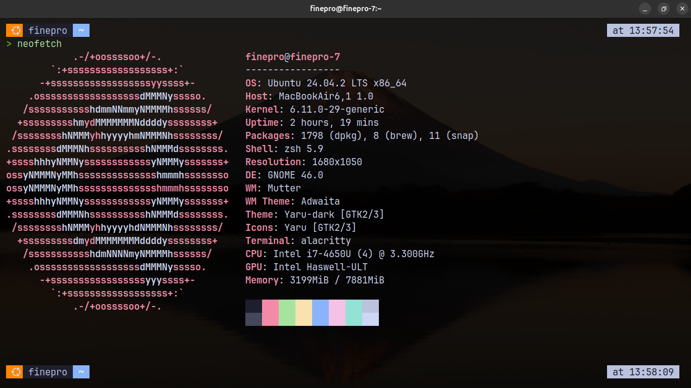

# ⚡ My Alacritty Config

A sleek, minimal, and modern **Alacritty terminal** configuration using **JetBrainsMono Nerd Font**, **transparent background**, and a beautiful **Catppuccin-inspired color scheme**. Optimized for developer productivity and aesthetic satisfaction.


---

## ✨ Features

- 🖋 JetBrainsMono Nerd Font for icons and glyphs
- 🎨 Catppuccin Mocha-inspired color palette
- 🪟 Transparent background with smart padding
- 🚀 Starship prompt ready
- ⌨️ Handy keybindings (Copy/Paste/New tab)
- 🧼 Clean and minimal look

---

## 📁 Config (`alacritty.toml`)

```toml
[window]
opacity = 0.85
decorations = "Full"
decorations_theme_variant = "Dark"

[window.padding]
x = 12
y = 12

[font]
size = 14.0

[font.normal]
family = "JetBrainsMono Nerd Font"

[font.bold]
family = "JetBrainsMono Nerd Font"

[font.italic]
family = "JetBrainsMono Nerd Font"

[font.bold_italic]
family = "JetBrainsMono Nerd Font"

[colors.primary]
background = "#000000"
foreground = "#cdd6f4"

[colors.cursor]
text = "#000000"
cursor = "#ffffff"

[colors.selection]
text = "CellForeground"
background = "#44475a"

[colors.normal]
black   = "#1e1e2e"
red     = "#f38ba8"
green   = "#a6e3a1"
yellow  = "#f9e2af"
blue    = "#89b4fa"
magenta = "#f5c2e7"
cyan    = "#94e2d5"
white   = "#bac2de"

[colors.bright]
black   = "#45475a"
red     = "#f38ba8"
green   = "#a6e3a1"
yellow  = "#f9e2af"
blue    = "#89b4fa"
magenta = "#f5c2e7"
cyan    = "#94e2d5"
white   = "#cdd6f4"

[scrolling]
history = 10000
multiplier = 3

[keyboard]
bindings = [
  { key = "V", mods = "Control|Shift", action = "Paste" },
  { key = "C", mods = "Control|Shift", action = "Copy" },
  { key = "N", mods = "Control|Shift", action = "SpawnNewInstance" }
]

[env]
TERM = "xterm-256color"
````

---

## 🛠️ Installation Steps

### 1. Clone this repository

```bash
git clone https://github.com/AdityaMalik7/alacritty-config.git
cd alacritty-config
```

### 2. Copy the config file

```bash
mkdir -p ~/.config/alacritty
cp alacritty.toml ~/.config/alacritty/
```

### 3. Install JetBrainsMono Nerd Font

Download the font from [Nerd Fonts](https://www.nerdfonts.com/font-downloads), then:

```bash
mkdir -p ~/.local/share/fonts
cp JetBrainsMonoNerdFont*.ttf ~/.local/share/fonts
fc-cache -fv
```

---

## 🌟 Optional: Use with Starship Prompt

### Install Starship:

```bash
curl -sS https://starship.rs/install.sh | sh
```

### Add this to your shell config:

#### Zsh:

```bash
echo 'eval "$(starship init zsh)"' >> ~/.zshrc
```

#### Bash:

```bash
echo 'eval "$(starship init bash)"' >> ~/.bashrc
```

#### Fish:

```bash
echo 'starship init fish | source' >> ~/.config/fish/config.fish
```

### Optional Starship Preset

```bash
starship preset nerd-font-symbols > ~/.config/starship.toml
```

---

## 📸 Screenshot

> 


---


## 🙌 Credits

* [Catppuccin Theme](https://github.com/catppuccin/alacritty)
* [Starship Prompt](https://starship.rs/)
* [Nerd Fonts](https://www.nerdfonts.com/)

---


